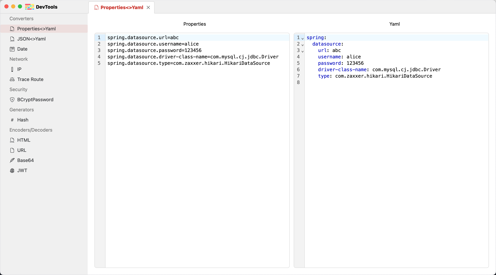
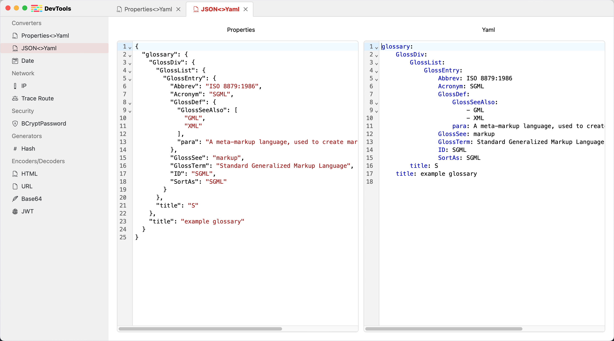
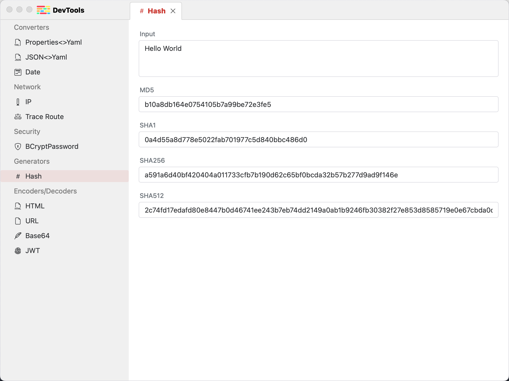
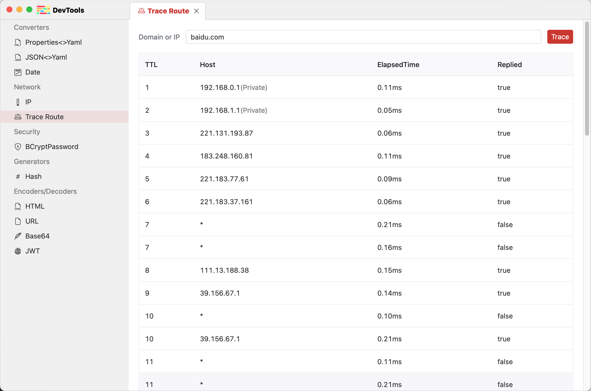

# README

## About

Tool Kit for developers


## Screenshot





## Introduction
- Converters
  - Properties <> YAML
  - JSON <> YAML
  - Timestamp
- Network
  - Current IP
- Serurity
  - Spring BCryptPassword
- Generators
  - Hash
- Encoders / Decoders
  - HTML
  - URL
  - Base64 Text
  - JWT Decoder

## Build Guidelines

### Prerequisites

* Go (latest version)
* Node.js >= 16
* NPM >= 9

### Install Wails

```bash
go install github.com/wailsapp/wails/v2/cmd/wails@latest
```

### Pull the Code

```bash
git clone https://github.com/mqshen/KExplorer --depth=1
```

### Build Frontend

```bash
npm install --prefix ./frontend
```

### Compile and Run

```bash
wails dev
```